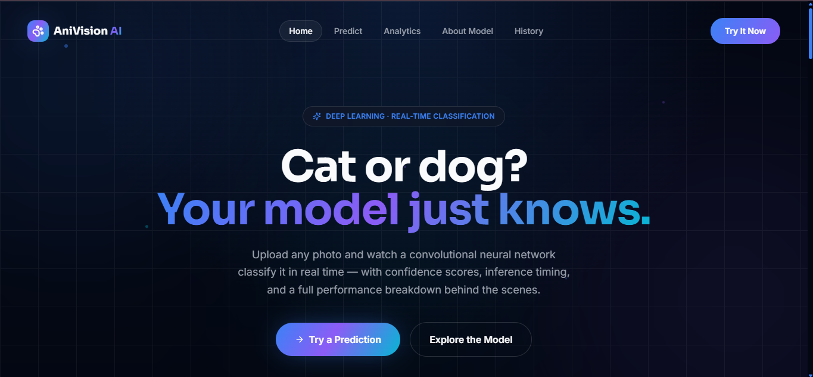
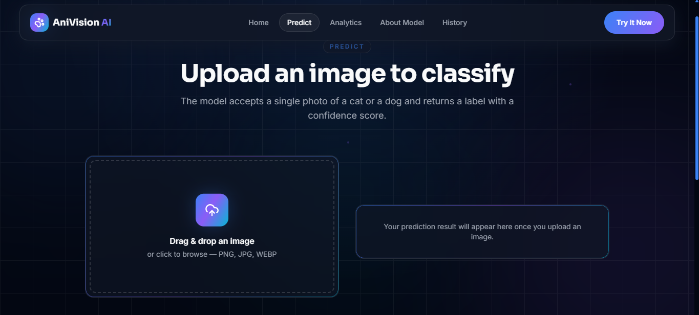
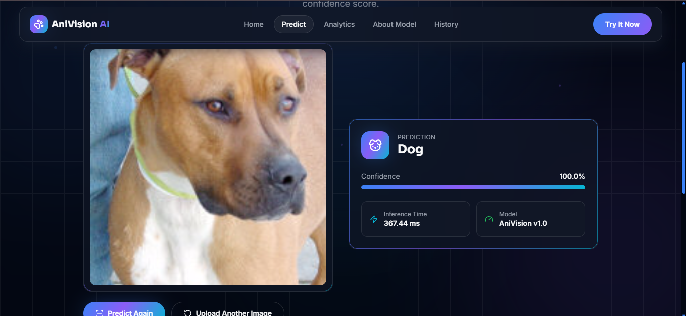

#  AniVision AI – Intelligent Cat vs Dog Image Classifier

<div align="center">

###  AI-Powered Image Classification using Deep Learning

**Built with PyTorch • ResNet18 • Transfer Learning**

</div>

---

##  Overview

**AniVision AI** is a deep learning-based image classification system that accurately identifies whether an uploaded image contains a **Cat** or a **Dog**.

The project uses **Transfer Learning** with **ResNet18**, allowing high accuracy while significantly reducing training time. It provides an end-to-end pipeline including dataset preparation, model training, evaluation, testing, and real-time prediction.

---

##  Features

*  Cat vs Dog Image Classification
*  Transfer Learning using ResNet18
*  Fast Prediction with Confidence Score
*  Model Evaluation (Accuracy, Precision, Recall, F1 Score)
*  Confusion Matrix & Classification Report
*  Automatic Best Model Saving
*  Custom Image Prediction
*  Data Augmentation
*  Clean Project Structure

---

## 🛠 Tech Stack

### Deep Learning

* PyTorch
* Torchvision
* Transfer Learning
* ResNet18

### Data Processing

* PIL (Pillow)
* ImageFolder
* DataLoader

### Evaluation

* Scikit-learn

### Utilities

* Python
* pathlib

---

##  Project Structure

```text
AniVision-AI/
│
├── data/
│   ├── train/
│   ├── validation/
│   └── test/
│
├── models/
│   ├── best_model.pth
│   └── history.pth
│
├── src/
│   ├── model.py
│   ├── dataset.py
│   ├── train.py
│   ├── evaluate.py
│   ├── test.py
│   ├── predict.py
│   └── utils.py
│
├── notebooks/
│
├── requirements.txt
│
└── README.md
```

---

##  Model

* Architecture: **ResNet18**
* Technique: **Transfer Learning**
* Loss Function: **CrossEntropyLoss**
* Optimizer: **Adam**
* Epochs: **10**
* Best Model Saved Automatically

---

##  Model Performance

| Metric        |      Score |
| ------------- | ---------: |
| Test Accuracy | **97.33%** |
| Precision     | **97.29%** |
| Recall        | **98.61%** |
| F1 Score      | **97.37%** |

### Confusion Matrix

|            | Predicted Cat | Predicted Dog |
| ---------- | ------------: | ------------: |
| Actual Cat |          1801 |            74 |
| Actual Dog |            26 |          1849 |

---

##  Installation

Clone the repository

```bash
git clone https://github.com/your-username/AniVision-AI.git
```

Move into the project

```bash
cd AniVision-AI
```

Install dependencies

```bash
pip install -r requirements.txt
```

---

##  Training

```bash
python src/train.py
```

---

##  Evaluate

```bash
python src/evaluate.py
```

---

##  Test

```bash
python src/test.py
```

---

##  Predict

```bash
python src/predict.py
```

Example Output

```text
Prediction : Dog
Confidence : 100.00%
```

---
## LIVE DEMO:

https://ani-vision-ai.vercel.app/

##  Screenshots

### Home Page



---

### Prediction Page



---

### Result



---

##  Learning Outcomes

Through this project, I learned:

* Transfer Learning
* ResNet18 Architecture
* CNN-based Image Classification
* Data Augmentation
* Model Evaluation
* Saving & Loading Models
* Building an End-to-End Deep Learning Pipeline

---

##  Future Improvements

* Multi-class Animal Classification
* EfficientNet Implementation
* Vision Transformer (ViT)
* Grad-CAM Visualization
* TensorBoard Integration
* FastAPI Backend
* Modern React Frontend
* Docker Deployment
* Cloud Deployment (AWS/GCP)

---

##  Author

**Manish Saini**

B.Tech Artificial Intelligence & Machine Learning

Aspiring AIML & LLM Engineer

---

 If you like this project, consider giving it a **Star** on GitHub.
